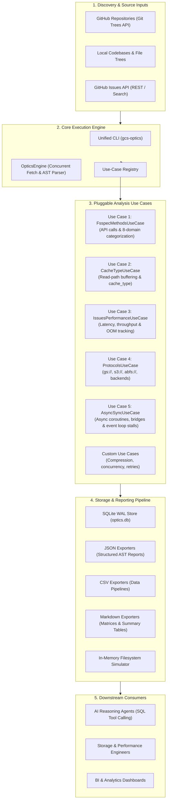
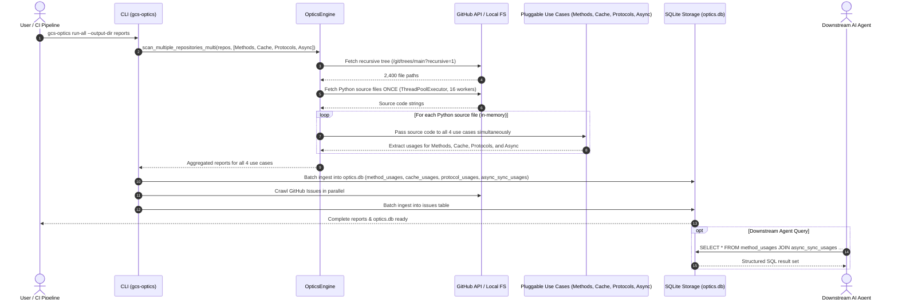
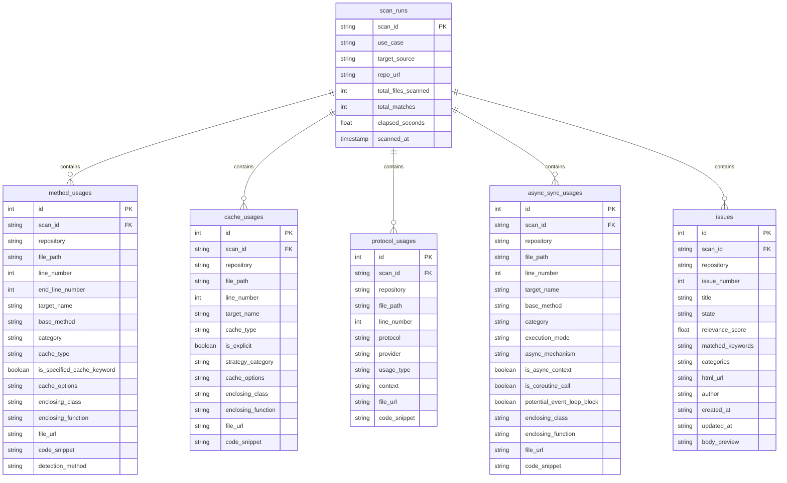
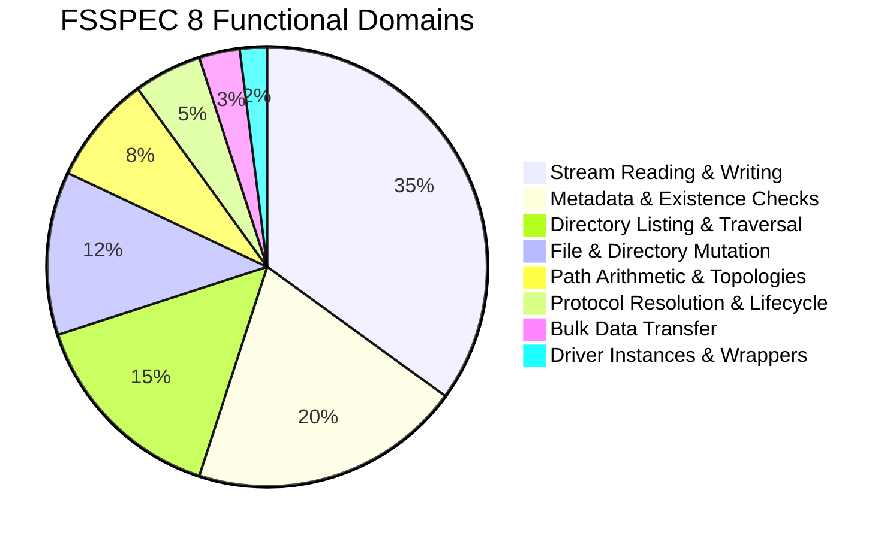
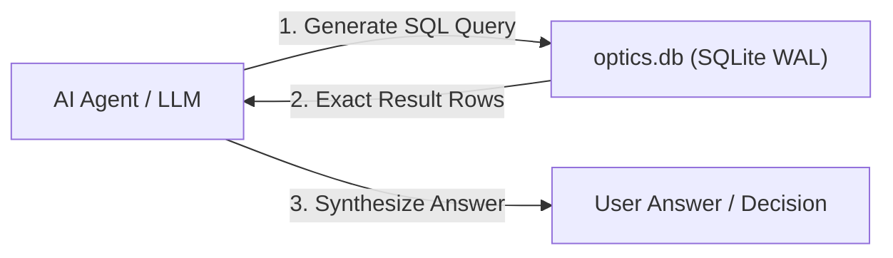
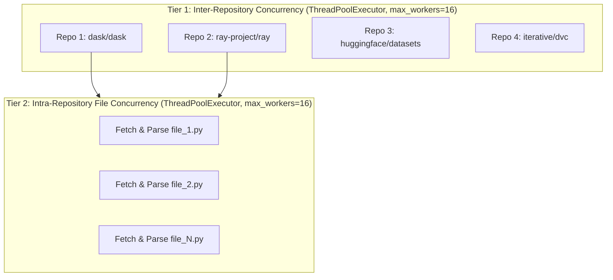

# GCS Clients Optics (`gcs-clients-optics`) — System Design Document

## 1. Executive Overview

**GCS Clients Optics** is an extensible AST code crawling, performance issue tracking, and analytics system designed for **Google Cloud Storage (GCS) and `fsspec` abstract filesystem optics**.

The system enables automated, deep-codebase inspection of how open-source data science, machine learning, and cloud infrastructure projects (Dask, Ray, Hugging Face Datasets, PyTorch, pandas, DVC, etc.) interact with abstract storage layers, read-path caching strategies, and storage protocols.



---

## 2. Component Architecture & Responsibilities

The system is decomposed into modular layers with strict separation of concerns:

```
src/gcs_clients_optics/
├── cli.py              # CLI Interface & Command Dispatcher
├── engine/             # Generic Execution & AST Orchestration Engine
│   └── optics_engine.py
├── usecases/           # Domain-Specific Analysis Use Cases
│   ├── base.py         # BaseUseCase Abstract Contract
│   ├── fsspec_methods.py
│   ├── cache_type.py
│   ├── issues_performance.py
│   └── protocols.py
├── crawler/            # AST Node Visitors & Repository Scanners
│   ├── ast_visitor.py
│   ├── engine.py
│   ├── models.py
│   └── repos.py
├── issues/             # GitHub Issues Crawler & Scoring Engine
│   ├── analyzer.py
│   ├── crawler.py
│   ├── keywords.py
│   └── models.py
├── analysis/           # Categorization, Matrices & Summary Tables
│   ├── categorization.py # Complete fsspec base spec ontology (8 domains)
│   ├── matrix.py
│   └── summary_table.py
├── storage/            # Relational SQLite Engine & Ingestion Pipeline
│   └── sqlite_store.py
├── reporters/          # Multi-Format Report Exporters
│   ├── code_reports.py
│   └── issue_reports.py
└── simulation/         # In-Memory Validation & Live Simulator
    └── simulator.py
```

### Component Responsibility Matrix

| Component | Module | Key Responsibilities | Inputs | Outputs |
| :--- | :--- | :--- | :--- | :--- |
| **CLI Dispatcher** | [`cli.py`](file:///usr/local/google/home/princer/code/gcs-clients-optics/src/gcs_clients_optics/cli.py) | Parses subcommands (`fsspec-methods`, `cache-type`, `issues`, `protocols`, `ingest`, `simulate`, `run-all`), resolves output paths (`.json`, `.csv`, `.md`, `.db`), and invokes engine workflows. | Command-line arguments & environment variables | Exit code & console feedback |
| **Optics Engine** | [`engine/optics_engine.py`](file:///usr/local/google/home/princer/code/gcs-clients-optics/src/gcs_clients_optics/engine/optics_engine.py) | Generic multithreaded orchestrator for scanning GitHub repositories via Git Trees API or local directory trees. Decoupled from specific use cases. | Target repository or local directory path + `BaseUseCase` | Aggregated report object |
| **Use-Case Registry** | [`usecases/`](file:///usr/local/google/home/princer/code/gcs-clients-optics/src/gcs_clients_optics/usecases/) | Encapsulates domain-specific AST visitors, scoring logic, aggregation, and export formatting under a uniform `BaseUseCase` interface. | Source code AST nodes & issue payloads | Domain reports (CrawlReport, CacheReport, ProtocolReport, IssueCrawlReport) |
| **AST Parser & Visitor** | [`crawler/ast_visitor.py`](file:///usr/local/google/home/princer/code/gcs-clients-optics/src/gcs_clients_optics/crawler/ast_visitor.py) | Traverses Python AST to extract method calls (`open`, `readinto`, `cat`, etc.), extracts `cache_type`, arguments, enclosing functions/classes, and line-level URLs. | Python source code string | List of `FsspecUsage` records |
| **Issue Performance Analyzer** | [`issues/analyzer.py`](file:///usr/local/google/home/princer/code/gcs-clients-optics/src/gcs_clients_optics/issues/analyzer.py) | Performs keyword matching, heuristic relevance scoring, and category tagging for cloud storage performance bottlenecks. | GitHub issue title & body text | Scored & categorized `GitHubIssue` |
| **Categorization Ontology** | [`analysis/categorization.py`](file:///usr/local/google/home/princer/code/gcs-clients-optics/src/gcs_clients_optics/analysis/categorization.py) | Complete formal ontology mapping 100% of `AbstractFileSystem` and `AbstractBufferedFile` methods into 8 standard functional domains. | Method name string | Functional category string & descriptive pattern |
| **SQLite Storage Engine** | [`storage/sqlite_store.py`](file:///usr/local/google/home/princer/code/gcs-clients-optics/src/gcs_clients_optics/storage/sqlite_store.py) | Normalized relational storage with WAL mode, indexing, and batch ingestion from live scans or JSON artifacts. | In-memory reports or JSON files | `optics.db` SQLite database |
| **Live Simulator** | [`simulation/simulator.py`](file:///usr/local/google/home/princer/code/gcs-clients-optics/src/gcs_clients_optics/simulation/simulator.py) | In-memory `fsspec` filesystem testbed executing live validation of directory hierarchies, wildcards, metadata, and stream reading. | None (self-contained) | Validation test execution results |

---

## 3. End-to-End Pipelining & Single-Pass Data Flow

The system employs a **Single-Pass Multi-Use-Case Execution Pipeline**. In a single crawl pass, each source file is downloaded **once** over the network, and all registered use cases (`FsspecMethodsUseCase`, `CacheTypeUseCase`, `ProtocolsUseCase`, `AsyncSyncUseCase`) evaluate the file in memory simultaneously:



---

## 4. SQLite Relational Schema & Indexing Model

The storage engine writes to a single SQLite database (`optics.db`) configured with Write-Ahead Logging (`PRAGMA journal_mode=WAL`) for concurrent reading by downstream AI agents.



---

## 5. Functional Ontology & Categorization Pipeline

The system maps all detected method calls into **8 standard functional domains** covering 100% of the methods in `fsspec.spec.AbstractFileSystem` and `fsspec.spec.AbstractBufferedFile`:



1. **Stream Reading & Writing**: `open`, `read`, `readinto`, `readinto1`, `readline`, `readlines`, `read_block`, `read_bytes`, `read_text`, `write`, `write_bytes`, `write_text`, `pipe`, `cat`, `cat_file`, `cat_ranges`, `head`, `tail`, `seek`, `tell`, `flush`, `close`.
2. **Metadata & Existence Checks**: `exists`, `lexists`, `info`, `stat`, `isdir`, `isfile`, `size`, `sizes`, `du`, `checksum`, `ukey`, `created`, `modified`, `sign`, `get_file_info`.
3. **Directory Listing & Traversal**: `ls`, `listdir`, `glob`, `find`, `walk`, `tree`, `expand_path`, `expand_paths_if_needed`, `FileSelector`.
4. **File & Directory Mutation**: `mkdir`, `makedirs`, `touch`, `rm`, `rm_file`, `rmdir`, `delete`, `copy`, `cp`, `move`, `mv`, `rename`.
5. **Bulk Data Transfer**: `get`, `get_file`, `download`, `put`, `put_file`, `upload`.
6. **Path Arithmetic & Topologies**: `_parent`, `join`, `split`, `parts`, `relparts`, `relpath`, `normpath`, `abspath`, `getcwd`, `chdir`, `isin`, `commonpath`, `as_posix`.
7. **Protocol Resolution & Driver Lifecycle**: `url_to_fs`, `filesystem`, `get_fs_token_paths`, `split_protocol`, `strip_protocol`, `unstrip_protocol`, `to_dict`, `to_json`, `start_transaction`, `end_transaction`, `invalidate_cache`.
8. **Driver Instances & Wrapper Bridges**: `_get_pyarrow_filesystem`, `ArrowFSWrapper`, `DirFileSystem`, `LocalFileSystem`, `GCSFileSystem`, `S3FileSystem`, `AzureBlobFileSystem`, `PyFileSystem`.

---

## 6. Extensibility Model: Adding New Use Cases

The architecture allows adding new specialized analysis use cases without modifying the core execution engine:

```python
from gcs_clients_optics import BaseUseCase, OpticsEngine, register_use_case

class ConcurrencyOpticsUseCase(BaseUseCase):
    name = "concurrency"
    description = "Analyze threading, asyncio, and multiprocessing patterns around storage I/O"
    aliases = ["async", "threading"]

    def scan_code(self, file_path: str, source_code: str, repo_url=None, branch="main"):
        # Custom AST visitor logic to identify async with fs.open() or ThreadPoolExecutor
        return [...]

    def aggregate_report(self, target_source, total_files, files_with_usages, usages, repo_url=None):
        return {...}

    def export_reports(self, reports, output_csv=None, output_json=None, output_md=None, output_sqlite=None, **kwargs):
        # Multi-format exports
        return {}

# Register globally
register_use_case(ConcurrencyOpticsUseCase())

# Run using generic engine
engine = OpticsEngine(use_case=ConcurrencyOpticsUseCase())
report = engine.scan_github_repo("dask/dask")
```

---

## 7. Downstream Agent Integration Pattern

Downstream AI coding agents can interact with the system via SQLite queries without parsing raw JSON/CSV dumps:



### Example Agent Interactions

| Question Asked to Agent | SQL Executed by Agent |
| :--- | :--- |
| *"Which repositories use `cat_ranges` for chunked reads?"* | `SELECT DISTINCT repository, file_path, line_number FROM method_usages WHERE base_method = 'cat_ranges';` |
| *"What percentage of read calls in Dask use `mmap` vs `readahead`?"* | `SELECT cache_type, COUNT(*) FROM cache_usages WHERE repository = 'dask/dask' GROUP BY 1;` |
| *"What are the top open performance issues in GCS filesystem libraries?"* | `SELECT repository, issue_number, title, relevance_score FROM issues WHERE relevance_score >= 10 ORDER BY relevance_score DESC LIMIT 5;` |
| *"Where is `readinto` called across all surveyed libraries?"* | `SELECT repository, file_path, line_number, code_snippet FROM method_usages WHERE base_method = 'readinto';` |

---

## 8. Performance & Concurrency Model

The system employs a **two-tier multi-threaded concurrency model** to maximize throughput while avoiding GitHub API rate limits:



1. **Tier 1: Inter-Repository Concurrency (`--concurrency` / `-j`, default: 16)**:
   - Multiple GitHub repositories or issues targets are crawled concurrently using `ThreadPoolExecutor(max_workers=16)`.
   - Progress callbacks report real-time completion status per repository as workers finish.
2. **Tier 2: Intra-Repository File Concurrency (default: 16)**:
   - Within each repository, all discovered Python source files are downloaded and parsed concurrently using a dedicated pool of 16 worker threads (`ThreadPoolExecutor(max_workers=16)`).
3. **AST-Native Speed**:
   - AST parsing (`ast.parse`) executes in native CPython bytecode, processing ~1,000 files/second per core with zero external process overhead.
4. **Git Trees Single-Call Discovery**:
   - Discovers entire 10,000+ file repository hierarchies in a single HTTP request using `api.github.com/repos/{owner}/{repo}/git/trees/{branch}?recursive=1`.
5. **SQLite WAL High-Throughput Ingestion**:
   - Database writes use Write-Ahead Logging (`PRAGMA journal_mode=WAL;`) and parameterized batch inserts (`executemany`), ingesting >50,000 usage records in under 200ms without table locking.
